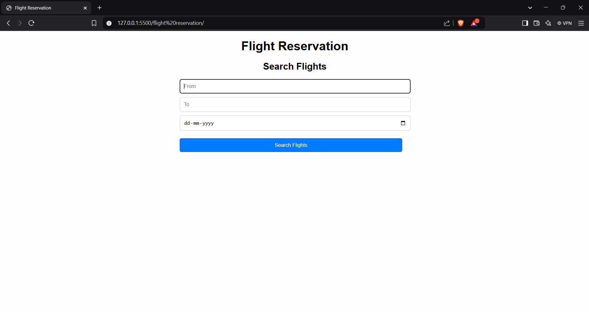
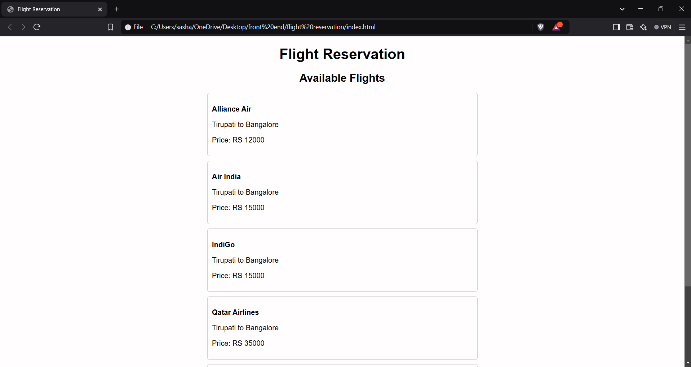

<h1>
  Flight Reservation
</h1>
<h3>
  Summary
</h3>

  Flight reservation refers to the process of booking a ticket for air travel. It typically involves choosing the destination, travel dates, preferred flight times, and the class of travel (economy, business, or first class). This process can be completed through airline websites, travel agencies, or booking platforms. Travelers must provide personal details, including identification, and make a payment to confirm their reservation. Additional options, such as seat selection, meal preferences, and baggage requirements, may also be included. Once the booking is complete, passengers receive a confirmation number or e-ticket, which serves as proof of their reservation. Modern systems allow travelers to check-in online, view their itinerary, and make changes if needed. Flight reservations streamline travel planning and ensure passengers secure their desired flight options well in advance, especially during peak seasons.

<h4>
  The intrface looks like :-
</h4>

<h4>
  The flighs looks like the :-
</h4>

<h4>
  The ticket looks like the :-
</h4>

